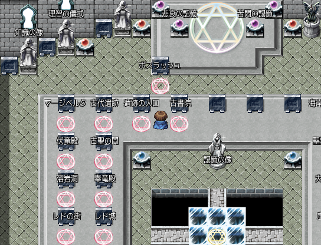

# Fanastasis ボスラッシュMOD

### 導入方法
導入は、**Map816.rvdata2**と**Map518.rvdata2**を本体の物と差し替えてください。

牢獄の間のエメルダと反対の位置にボスラッシュの魔法陣が出現するため、\
そこに入ってください。\
※一度入ったらクリアするまでは戻ってこれません。

セーブ地点が牢獄の間の場合は、他のマップに行ってから再度牢獄の間に戻ってきてください。\
それで魔法陣が出現するようになります。

このMODを導入した状態でのセーブは推奨されません。\
差し替えたファイルを元に戻すことで導入前の状態に戻ります。

### MOD概要
強さ：ボスはそのままの強さ\
対象：理智のジェムを落とす48体のボス

牢獄の間には戻れないが\
1戦ごとにイベントが終了するため\
合間での回復や装備入れ替えが可能
